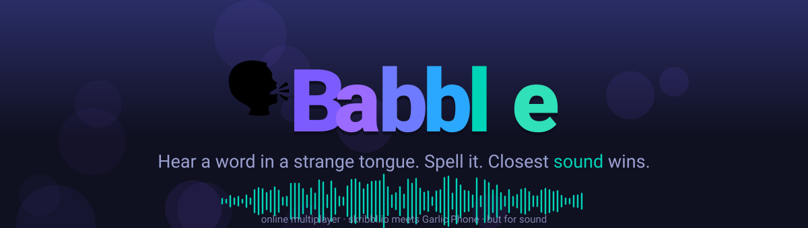
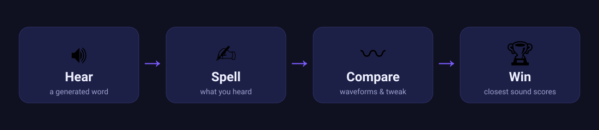
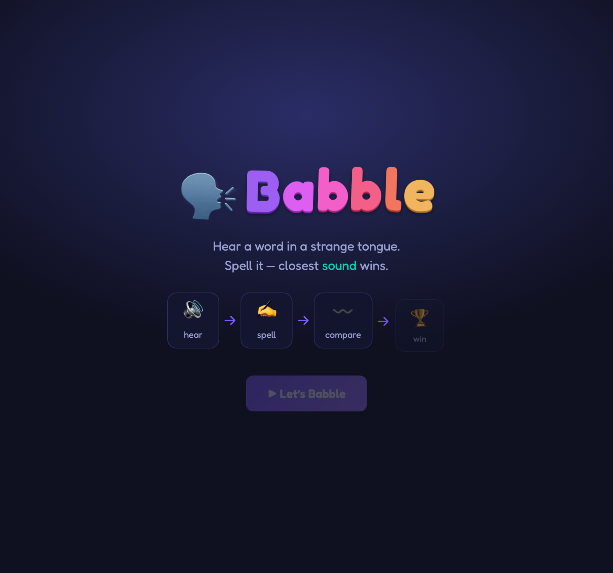
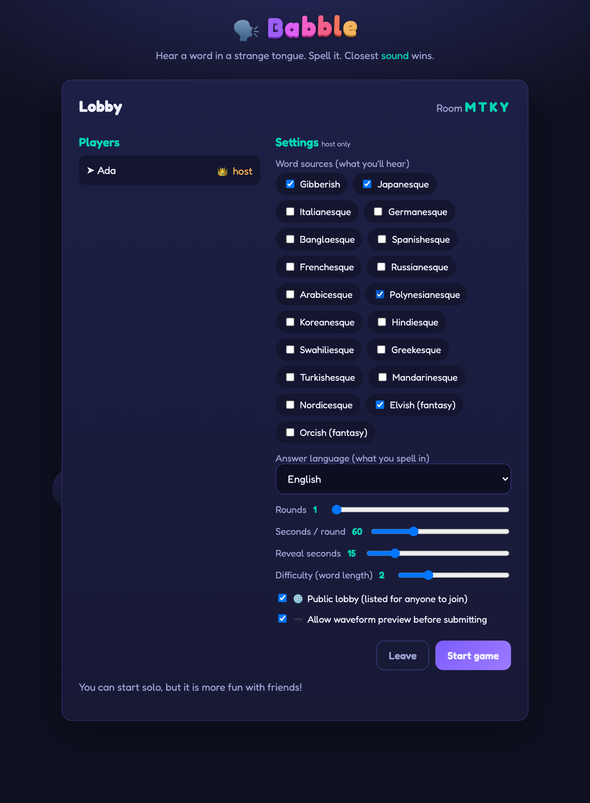
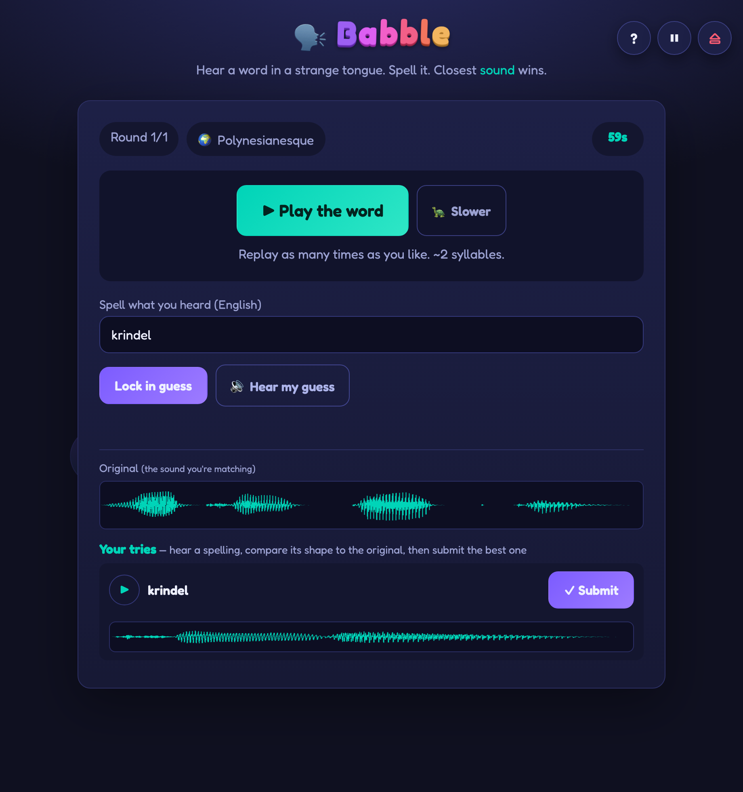
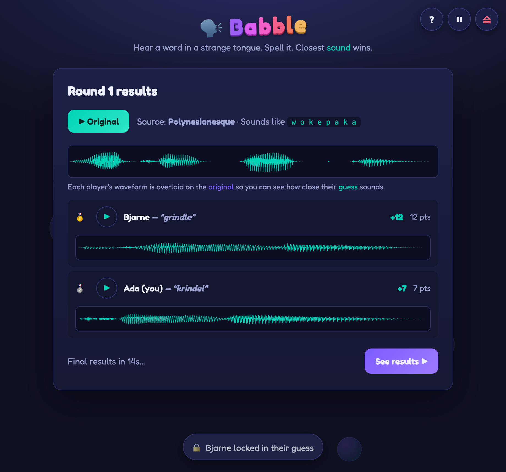
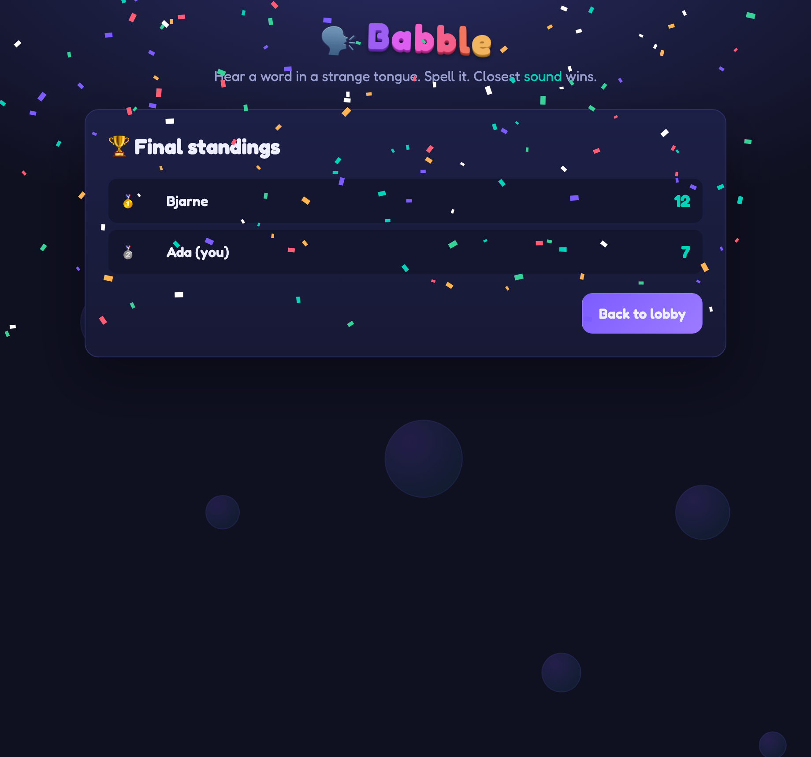
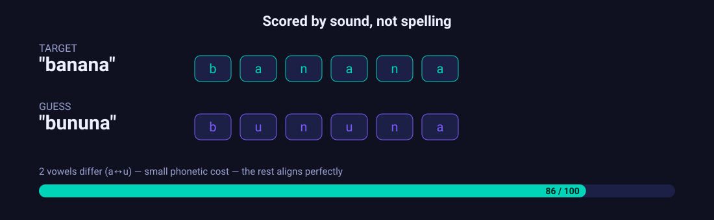
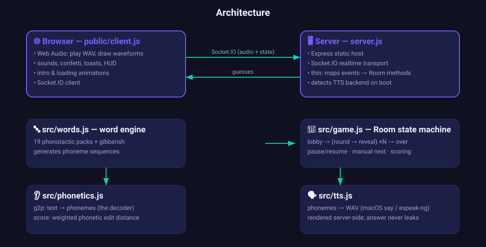

<p align="center">
  
</p>

<p align="center">
  An online multiplayer browser game in the spirit of <i>skribbl.io</i> and <i>Garlic Phone</i> —
  but the medium is <b>sound</b>, not drawing.
</p>

<p align="center">
  <a href="https://babble.hebdo.duckdns.org"><b>▶ Play the live demo — babble.hebdo.duckdns.org</b></a>
</p>

An automated engine picks a random word (from a real-ish language pack or pure
**gibberish**). Everyone **hears** it spoken aloud and can replay it as many times
as they like. You then **spell what you heard** in a common answer language
(English, Bengali, …). The game runs every guess through a **text‑to‑sound
decoder** and scores each player by how close their guess *sounds* to the
original. Closest sound wins.

<p align="center"></p>

## Screenshots

<table>
  <tr>
    <td width="50%"><br><sub><b>Animated intro</b> — wordart logo and the hear → spell → compare → win flow.</sub></td>
    <td width="50%"><br><sub><b>Lobby</b> — pick from 19 word-source packs, public/private, preview toggle, round &amp; timing.</sub></td>
  </tr>
  <tr>
    <td width="50%"><br><sub><b>Play</b> — replay the word, then stack your tries and compare each one's waveform to the original before submitting.</sub></td>
    <td width="50%"><br><sub><b>Reveal</b> — every guess is pronounced &amp; scored; each waveform is overlaid on the original so you can <i>see</i> how close it sounded.</sub></td>
  </tr>
</table>

<p align="center"><br><sub><b>Final standings</b> — confetti + a victory fanfare.</sub></p>

## Quick start

> 🌐 **Live demo:** [babble.hebdo.duckdns.org](https://babble.hebdo.duckdns.org) — grab a friend (or open two tabs) and play.

```bash
npm install
npm start            # http://localhost:3000
```

Open the URL in two tabs (or share `http://<your-ip>:3000` on your LAN). One
player **Creates a room** and shares the 4‑letter code; others **Join**. The
host tweaks settings and hits **Start**.

### Audio / voices

Speech is synthesized **on the server** and streamed to players as WAV, so
everyone hears the same thing and the browser only has to play it. The backend
is **configurable** via `BABBLE_TTS` and resolved once at boot (the server logs
which one it picked). No API keys, fully offline.

| Backend | Sound | Setup |
|---|---|---|
| **piper** | 🟢 neural, natural | install piper + a voice model (below) — **recommended** |
| **say** | 🟡 decent | built into macOS, used automatically there |
| **espeak-ng** | 🟠 clear but robotic | `apt install espeak-ng` / `brew install espeak-ng` |

Default is `auto`: **piper → say → espeak**, whichever is available. Force one
with `BABBLE_TTS=piper|say|espeak`.

**Using Piper (the natural one):**

```bash
# 1. install piper + download a voice (medium = natural, ~60 MB)
python3 -m venv ~/piper && ~/piper/bin/pip install piper-tts
mkdir -p ~/piper-voices && cd ~/piper-voices
~/piper/bin/python -m piper.download_voices en_US-amy-medium   # browse names with: ... download_voices

# 2. point Babble at it
export BABBLE_TTS=piper
export PIPER_BIN=~/piper/bin/piper
export PIPER_MODEL=~/piper-voices/en_US-amy-medium.onnx
npm start            # boot log should read: TTS backend: piper (en_US-amy-medium)
```

In production set those three as `Environment=` lines in `deploy/babble.service`.
Swap the voice by downloading another model (e.g. `en_GB-cori-high`,
`en_US-lessac-medium`) and changing `PIPER_MODEL`.

Whichever backend, the synthesizer is driven by a **consistent spelling** of each
word's phonemes, so the target and every guess always render the same way — which
is what keeps scoring fair.

## Deploying to production

A small Node app — any VPS works. Example on a fresh **Debian/Ubuntu** box:

```bash
# 1. prerequisites
sudo apt update
sudo apt install -y nodejs npm espeak-ng nginx   # espeak-ng = the TTS engine on Linux

# 2. get the code + install deps
git clone <your-repo> ~/babble && cd ~/babble
npm install --omit=dev                            # runtime deps only

# 3. run it as a service (survives crashes, reboots, logout)
#    edit User=/WorkingDirectory=/node path in the file first — see `which node`
sudo cp deploy/babble.service /etc/systemd/system/babble.service
sudo systemctl daemon-reload && sudo systemctl enable --now babble
journalctl -u babble -f                           # logs; should show "TTS backend: espeak-ng"

# 4. put nginx in front (handles the WebSocket upgrade Socket.IO needs)
sudo cp deploy/nginx-babble.conf /etc/nginx/sites-available/babble
sudo ln -s /etc/nginx/sites-available/babble /etc/nginx/sites-enabled/babble
sudo nginx -t && sudo systemctl reload nginx

# 5. HTTPS (free, recommended — WebSockets + mic-free audio still want a secure origin)
sudo apt install -y certbot python3-certbot-nginx
sudo certbot --nginx -d your-domain.com
```

Then open `https://your-domain.com`. The service binds to `127.0.0.1:3000`
(set in the unit file) so the app is only reachable through nginx.

**Firewall (GCP/AWS/etc.):** allow inbound **80** and **443**; you do *not* need
to expose 3000. On GCP:

```bash
gcloud compute firewall-rules create babble-web --allow tcp:80,tcp:443 --source-ranges 0.0.0.0/0
```

**Config via env vars:** `PORT` (default 3000), `HOST` (default `0.0.0.0`; set
`127.0.0.1` behind a proxy). No other configuration or API keys.

> Don't have a domain? Skip nginx/certbot, set `HOST=0.0.0.0` in the unit file,
> open port 3000 in the firewall, and reach it at `http://<vps-ip>:3000`.

## How scoring works (the interesting bit)

Comparing raw audio waveforms in a browser is flaky, so Babble scores in a
language-neutral **phoneme** space instead — which is exactly what "compare the
sound" means:

1. **Targets are sounds, not spellings.** Each word is generated directly as a
   sequence of phonemes (`src/words.js`). Gibberish is random phonotactically
   plausible nonsense; language packs constrain the phoneme inventory and
   syllable shapes so output *sounds* Japanese / Italian / Bengali-ish without
   being a real, lookup-able word.
2. **You hear it.** The server renders those phonemes to audio (`src/tts.js`) and
   sends only the WAV — never the phonemes — so the answer can't be sniffed off
   the wire during play. Replay it as often as you like, or hit 🐢 for a slower
   take.
3. **The decoder** (`g2p` in `src/phonetics.js`) turns your typed guess back into
   phonemes — literally pronouncing your text. English, Bengali (Bangla script)
   and a romanized fallback are built in; add more by extending `DECODERS`.
4. **Comparison** is a weighted phonetic edit distance: swapping similar sounds
   (`b`↔`p`, `s`↔`z`, nearby vowels) costs little; swapping a vowel for a
   consonant costs a lot. The result maps to a **0–100** similarity score.

Because it scores *sound*, `banana`, `bananna`, and `bunana` all score near the
top — the letters differ but the pronunciation barely does.

<p align="center"></p>

At the **reveal** you get the whole picture: every player's guess in text, a
▶ button to **play each guess** (rendered from the exact phonemes it was scored
on), and a **waveform** of each guess overlaid on the original so you can *see*
how close it landed. All scoring happens on the server; clients never receive
the target phonemes until the reveal.

## Settings (host)

| Setting | Meaning |
|---|---|
| Word sources | Which of the **19 packs** the engine draws from — Gibberish, real-language flavours (Japanese, Italian, German, Bengali, Spanish, French, Russian, Arabic, Polynesian, Korean, Hindi, Swahili, Greek, Turkish, Mandarin, Nordic) and fantasy (Elvish, Orcish) |
| Answer language | Which decoder scores your guesses (English / Bengali / Spanish) |
| Rounds | 1–20 |
| Seconds / round | 10–180 |
| Reveal seconds | 5–60, how long results show before the next round |
| Difficulty | 1–5, scales word length (syllable count) |
| Public lobby | Public games are listed in the join-screen browser; private games are code-only |
| Waveform preview | Lets players see the original waveform and stack/compare their tries before submitting |

### During a game

- **HUD (top-right):** **?** help, **⏸ / ▶** pause-resume (host), **⏏** exit.
- **Lock-in alerts:** a toast + chime tells everyone when another player locks in.
- **Clock ticks** in the final 10 seconds (faster in the last 5).
- **Reveal:** the host can hit **Next round ▶** to skip the countdown.
- **Win:** confetti + a victory fanfare on the final standings.

All sound effects are synthesized in the browser (Web Audio) — no asset files.

## Architecture

<p align="center"></p>

```
server.js              Express static host + Socket.IO transport (thin)
src/phonetics.js       text→sound decoder (g2p) + sound comparison (score)
src/tts.js             server-side speech synth (macOS say / espeak-ng)
src/words.js           the automated word/gibberish generator
src/game.js            Room + round state machine (lobby → rounds → results)
public/                index.html · style.css · client.js (Web Audio playback + waveforms)
assets/                README graphics (make-graphics.js) + screenshots (screenshot.js)
test/                  phonetics · tts · game (unit) · integration · features (e2e)
```

## Tests

```bash
npm test            # decoder + scoring + TTS + room-logic unit checks
npm run test:e2e    # boots a server: full round + pause/resume/lock/next/public-lobby
```

## Extending

- **A new language pack to hear:** add an entry to `PACKS` in `src/words.js`
  with its phoneme inventory, syllable `shapes`, and a BCP-47 `voice` tag.
- **A new answer language to spell in:** add a `g2p` function and register it in
  `DECODERS` in `src/phonetics.js`, plus an `<option>` in `index.html`.
- **Real (non-gibberish) words:** feed real phoneme transcriptions into a pack's
  generator instead of synthesizing syllables.

## Regenerating the README art

The diagrams are authored SVGs; the screenshots are captured from a real game.

```bash
node assets/make-graphics.js     # banner, gameplay, architecture, scoring, reveal SVGs

# real screenshots (one-time browser install, ~90 MB):
npm i -D playwright && npx playwright install chromium
node assets/screenshot.js        # → assets/screenshots/*.png
```

## Ideas / roadmap

- True audio comparison (MFCC + DTW on recorded TTS) as an optional scoring mode.
- Per-guess "warmer/colder" hints.
- Reconnect-by-token so a refresh rejoins your seat mid-game.
- Custom word lists / themed packs.

MIT.
